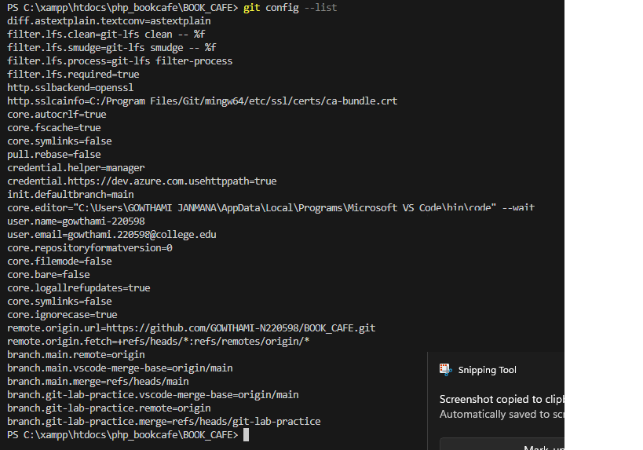
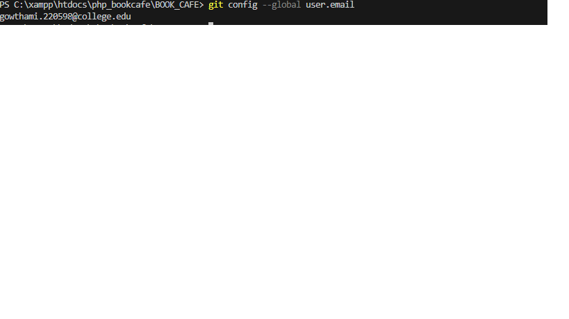
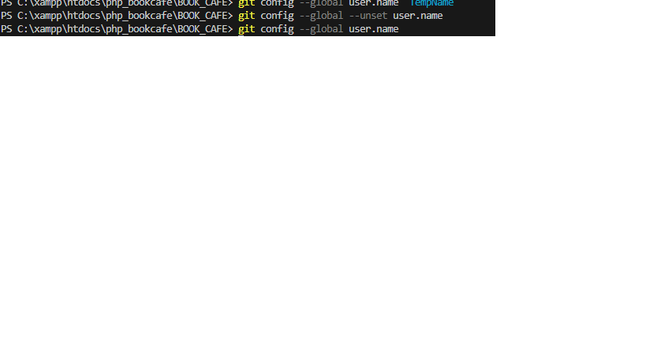
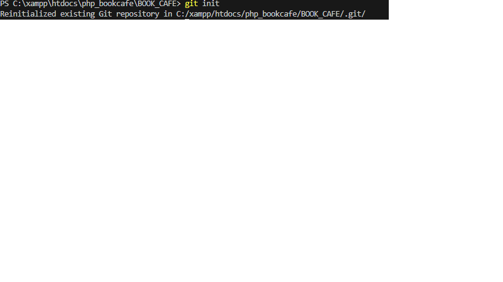
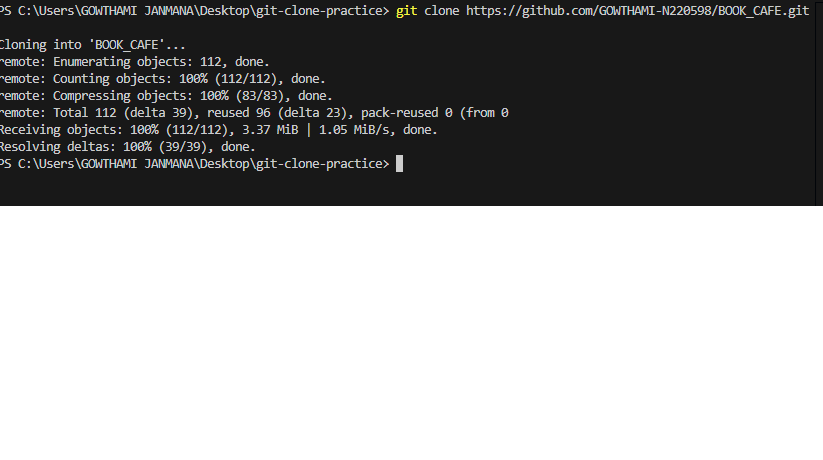

### command:
git config --list
### purpose
Displays all Git configuration settings
(username,email,core settings,etc).
### Example:
git config --list
### syntax
git config --list
### screenshot proof

## command:git config --global user.name
### syntax:
git config --global user.name "Your Name"
### purpose:
Sets or displays the global username used for Git commits.
### Example:
git config --global user.name
### screenshot Proof:
![Git Username]
(global_user.name.png)

## command:git config --global user.email
### syntax:
git config --global user.name "your-email@example.com"
### purpose:
Sets or displays the global email used for Git commits.
### Example:
git config --global user.email
### screenshot Proof:

## Command: git config --unset

### Syntax:
git config --global --unset user.name

### Purpose:
Removes a specific Git configuration setting.

### Example:
git config --global --unset user.name

### Screenshot Proof:

## Command: git init

### Syntax:
git init

### Purpose:
Initializes a new Git repository in the current folder. Creates a .git folder to track changes.

### Example:
git init

### Screenshot Proof:

## Command: git clone
### Syntax:
git clone <repository-url>
### Purpose:
Copies a remote repository from GitHub (or another server) to your local computer.  
Creates a folder with all files and full commit history.
### Example:
git clone https://github.com/your-username/bookcafe.git
### Screenshot Proof:
